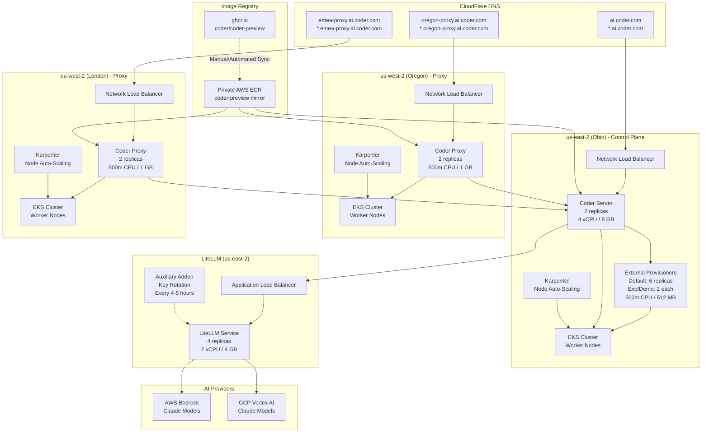

# ai.coder.com Architecture Overview

This document provides a visual and technical overview of the multi-region infrastructure for https://ai.coder.com.

---

## High-Level Architecture

---

## Component Details

### Control Plane (us-east-2 - Ohio)

**Coder Server**

- **Function**: Main control plane for workspace management
- **Deployment**: Helm release managed via Terraform
- **Replicas**: 2
- **Resources**: 4 vCPU / 8 GB per replica
- **Capacity**: Supports up to 1,000 users
- **Image**: `ghcr.io/coder/coder-preview` (mirrored to private ECR)
- **Ingress**: Network Load Balancer
- **Authentication**: GitHub OAuth (external users), Okta OIDC (internal users)

**External Provisioners**

- **Function**: Execute Terraform operations for workspace lifecycle
- **Deployment**: Helm release managed via Terraform
- **Replicas**:
  - Default org: 6 replicas (scale to 8-10 for workshops >15 users)
  - Experimental org: 2 replicas
  - Demo org: 2 replicas
- **Resources**: 500m CPU / 512 MB per replica
- **Limitation**: 1 provisioner = 1 concurrent Terraform operation
- **IAM**: AWS IAM role for EC2 workspace provisioning

**Karpenter**

- **Function**: Dynamic node auto-scaling for EKS cluster
- **Triggers**: Pod pending state, resource requests
- **AMI**: EKS-optimized Ubuntu/Bottlerocket/AL2023
- **Dependencies**: AWS SQS, EventBridge, IAM roles

---

### Proxy Clusters

**Oregon Proxy (us-west-2)**

- **Function**: Regional workspace access proxy
- **Replicas**: 2
- **Resources**: 500m CPU / 1 GB per replica
- **Domains**: `oregon-proxy.ai.coder.com` + `*.oregon-proxy.ai.coder.com`
- **Ingress**: Network Load Balancer
- **Token**: Managed via Terraform `coderd_workspace_proxy` resource

**London Proxy (eu-west-2)**

- **Function**: Regional workspace access proxy
- **Replicas**: 2
- **Resources**: 500m CPU / 1 GB per replica
- **Domains**: `emea-proxy.ai.coder.com` + `*.emea-proxy.ai.coder.com`
- **Ingress**: Network Load Balancer
- **Token**: Managed via Terraform `coderd_workspace_proxy` resource

---

### LiteLLM Service (us-east-2)

**LiteLLM Deployment**

- **Function**: LLM proxy/router for AI features
- **Deployment**: Kubernetes manifests (not Helm)
- **Replicas**: 4 (scale to 6-8 for workshops >20 users)
- **Resources**: 2 vCPU / 4 GB per replica
- **Ingress**: Application Load Balancer (HTTPS)
- **Providers**: Round-robin between AWS Bedrock and GCP Vertex AI
- **Models**: Claude (Sonnet, Haiku, Opus)

**Auxiliary Key Rotation**

- **Function**: Periodically generates and rotates LiteLLM keys
- **Frequency**: Every 4-5 hours
- **Impact**: Forces all workspaces to restart and consume new key
- **Note**: Disable during workshops to avoid disruptions

**Authentication**

- **AWS Bedrock**: IAM role with limited Bedrock permissions
- **GCP Vertex**: Service account with Vertex AI permissions

---

### Image Management

**Source**: `ghcr.io/coder/coder-preview`

- Non-GA preview image with beta AI features
- Publicly accessible on GitHub Container Registry

**Private ECR Mirror**

- Mirrored copy in AWS ECR (us-east-2)
- **Critical**: Must stay in sync with GHCR source
- **Issue**: Manual sync process prone to drift
- **Solution**: See Issue #7 for automation

**Workspace Images**

- Build from Scratch w/ Claude: Stored in private ECR
- Build from Scratch w/ Goose: Stored in private ECR
- Real World App w/ Claude: `codercom/example-universal:ubuntu` (DockerHub)

---

### DNS Management (CloudFlare)

**Managed Domains**:

1. `ai.coder.com` + `*.ai.coder.com` → us-east-2 NLB
2. `oregon-proxy.ai.coder.com` + `*.oregon-proxy.ai.coder.com` → us-west-2 NLB
3. `emea-proxy.ai.coder.com` + `*.emea-proxy.ai.coder.com` → eu-west-2 NLB

**Current Process**: Manual changes via #help-me-ops Slack channel
**Improvement**: See Issue #9 for Terraform automation

---

## Workspace Templates

### Build from Scratch w/ Claude

- **Image**: Custom image from private ECR
- **Pre-installed**: Claude Code CLI, desktop-commander, playwright
- **Resources**: 2-4 vCPU, 4-8 GB (user-configurable)
- **LLM Provider**: LiteLLM
- **GitHub Auth**: Optional (use personal credentials or coder-contrib account)
- **AI Interface**: Claude coder_app via AgentAPI or Coder Tasks

### Build from Scratch w/ Goose

- **Image**: Custom image from private ECR
- **Pre-installed**: Goose CLI, desktop-commander, playwright
- **Resources**: 2-4 vCPU, 4-8 GB (user-configurable)
- **LLM Provider**: LiteLLM
- **GitHub Auth**: Optional
- **AI Interface**: Goose coder_app via AgentAPI or Coder Tasks

### Real World App w/ Claude

- **Image**: `codercom/example-universal:ubuntu` (DockerHub)
- **Application**: Django app (auto-starts on workspace launch)
- **Pre-installed**: Claude Code CLI, AgentAPI
- **Resources**: 2-4 vCPU, 4-8 GB (user-configurable)
- **LLM Provider**: LiteLLM
- **GitHub Auth**: Optional
- **Use Case**: Live application modification with AI assistance

---

## Supporting Infrastructure

### AWS Load Balancer Controller

- **Function**: Manages AWS NLB/ALB via Kubernetes Service/Ingress objects
- **Deployment**: Helm release managed via Terraform
- **IAM**: Dedicated IAM role with LoadBalancer management permissions

### AWS EBS CSI Driver

- **Function**: Provisions EBS volumes via Kubernetes PersistentVolume objects
- **Deployment**: Helm release managed via Terraform
- **IAM**: Dedicated IAM role with EBS management permissions

### cert-manager

- **Function**: SSL certificate renewal for all load balancers
- **Integration**: Works with AWS Load Balancer Controller

---

## Capacity Planning

### Concurrent User Targets

| Users | Provisioner Replicas | LiteLLM Replicas | Karpenter Nodes |
| ----- | -------------------- | ---------------- | --------------- |
| <10   | 6 (default)          | 4 (default)      | Auto-scale      |
| 10-15 | 8                    | 4                | Auto-scale      |
| 15-20 | 10                   | 4-6              | Auto-scale      |
| 20-30 | 12-15                | 6-8              | Auto-scale      |

### Workspace Resource Allocation

**Per Workspace** (template-dependent):

- **CPU**: 2-4 vCPU
- **Memory**: 4-8 GB
- **Storage**: Ephemeral volumes (node-local)

**Example**: 15 concurrent workspaces @ 4 vCPU / 8 GB each = 60 vCPU / 120 GB total

---

## Known Limitations & Issues

### Storage

- **Issue**: Ephemeral volume storage capacity limited per node
- **Impact**: Workspaces restart when nodes exhaust storage
- **Tracking**: Issue #1

### Image Synchronization

- **Issue**: ECR mirror can fall out of sync with GHCR
- **Impact**: Image version mismatch causes subdomain routing failures
- **Tracking**: Issue #2, Issue #7

### LiteLLM Key Rotation

- **Issue**: Automatic rotation every 4-5 hours forces workspace restarts
- **Impact**: User progress lost during workshops if rotation occurs
- **Mitigation**: Disable rotation before workshops
- **Tracking**: Issue #3

### DNS Management

- **Issue**: Manual process via Slack requests
- **Impact**: Slow incident response, dependency on ops team
- **Tracking**: Issue #9

### Provisioner Scaling

- **Issue**: Manual scaling required, no auto-scaling
- **Impact**: Timeouts during simultaneous workspace operations
- **Tracking**: Issue #8

---

## Related Documentation

- [Monthly Workshop Guide](./MONTHLY_WORKSHOP_GUIDE.md)
- [Pre-Workshop Checklist](./PRE_WORKSHOP_CHECKLIST.md)
- [Incident Runbook](./INCIDENT_RUNBOOK.md)
- [Post-Workshop Retrospective Template](./POST_WORKSHOP_RETROSPECTIVE.md)
- [Participant Guide](./PARTICIPANT_GUIDE.md)

---

## Future Expansion

Planned additional demo environments:

### coderdemo.io

- **Purpose**: SE official demo environment
- **Level**: Production-grade, best practices, reference architecture
- **Status**: Not yet live

### devcoder.io

- **Purpose**: CS / Engineering collaboration environment
- **Use Case**: Enablement, internal feedback loops, dogfooding
- **Status**: Not yet live

---

**Last Updated**: October 2024  
**Maintained By**: Infrastructure Team  
**Questions**: #help-me-ops or jullian@coder.com
